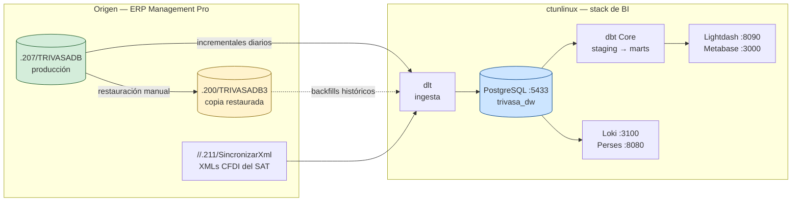

# Arquitectura

El entorno completo: de dónde sale la data, por dónde pasa y dónde termina.

## Documentos

- **[Servidores y bases](servidores-y-bases.md)** — topología de SQL Server, qué base es cuál, `EMPRESAS_2` como catálogo de control, respaldos. **Leer antes de escribir cualquier query.**
- **[El ERP: Management Pro](erp-management-pro.md)** — qué es el sistema origen, sus tres capas (escritorio VB6, IIS, servicio .NET), cómo se conecta a la base, y la deuda técnica que afecta leer su código.
- **[Stack de BI en ctunlinux](stack-bi.md)** — servicios, puertos, repos, extracción con dlt, transformación con dbt, orquestación, observabilidad, `torep` (captura de output de scripts/SQL a HTML) y el DuckDB CLI + conector `mssql`.
- **[Hosting de la wiki](wiki-hosting.md)** — cómo se publica este sitio.

## El recorrido de un dato

## Lo esencial

| Pregunta | Respuesta corta |
|---|---|
| ¿Dónde están los números oficiales? | `192.168.117.207/TRIVASADB` |
| ¿Dónde exploro sin arriesgar producción? | `192.168.117.200/TRIVASADB3` |
| ¿Con qué se extrae? | **dlt** (no Meltano) |
| ¿Dónde vive el warehouse? | PostgreSQL en `ctunlinux:5433`, base `trivasa_dw` |
| ¿Con qué se transforma? | dbt Core, proyecto `trivasa_dbt` |
| ¿Qué orquesta? | Cron hoy; la convención declarada es systemd timers |
| ¿Dónde está la config de los servicios? | `~/stack/`, fuera de git |
