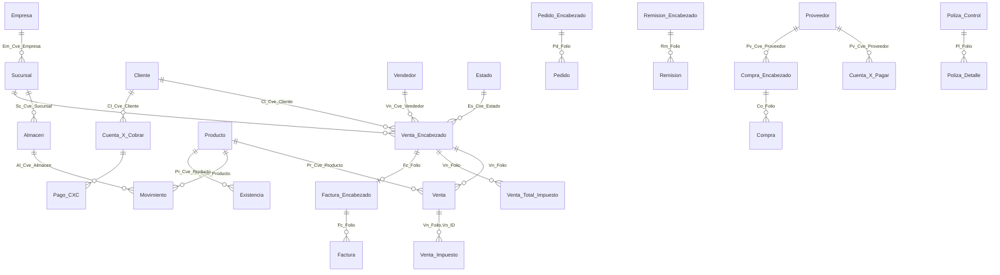

# Dominios de negocio y catálogos núcleo

> Mapa de qué hay en la base y dónde. `TRIVASADB3`: 1,454 tablas, **822 con datos**, 632 vacías, 88.4 M filas, ~105 GB.
>
> Esquemas: `dbo` (1,432 tablas — todo el negocio), `HangFire` (11, scheduler de una app .NET), `oqs` (11, Open Query Store — monitoreo, no es negocio).
>
> Verificado 2026-08-10.

## Dominios

| Dominio | Tablas | Filas | GB | Núcleo |
|---|---:|---:|---:|---|
| **CONTABILIDAD** | 25 | 25.2 M | 4.9 | `Poliza_Detalle`, `Poliza_Control`, `Banco_Movimiento`, `Transferencia` (ver [Transferencia](#transferencia) abajo) |
| **VENTAS** | 28 | 10.7 M | 5.1 | `Venta`/`Venta_Encabezado`, `Remision`, `Pedido`, `Factura`, `Precio_Minimo` |
| **NÓMINA** | 44 | 7.5 M | 5.6 | `Pre_Nomina`, `Nomina`, `Control_Asistencia`, `Empleado` |
| **LOGÍSTICA** | 30 | 7.2 M | 2.6 | `Orden_Entrega`, `Entrega_Documento`, `Viaje`, `Complemento_Carta_Porte` |
| **INVENTARIO** | 34 | 6.1 M | 3.8 | `Movimiento`, `Existencia`, `Producto`, `Traspaso` |
| **GASTOS** | 16 | 5.5 M | 1.2 | `Gasto_Registro`, `Gasto_Registro_Documento`, `Gasto_Registro_Control` |
| **CFDI/FISCAL** | 82 | 4.2 M | 15.0 | `Comprobante_Digital`, familia `ZFB_*` |
| **CXC** | 6 | 4.1 M | 1.3 | `Cuenta_X_Cobrar`, `Pago_CXC`, `Recibo_Pago` |
| **DOCUMENTOS** | 17 | 3.5 M | **62.4** | `Imagen_Objeto`, `ZTRV_Almacen_Digital`, `Comentario`, `Adjunto` |
| **SEGURIDAD/SIST** | 27 | 1.7 M | 0.3 | `Login`, `Log`, `Folio`, `Configuracion` |
| **CXP** | 6 | 1.6 M | 0.4 | `Cuenta_X_Pagar`, `Pago_Cxp_Comprobante` |
| **SERVICIOS/CRM** | 15 | 0.8 M | 0.2 | `Orden_Servicio`, `Contrato` |
| **COMPRAS** | 18 | 0.8 M | 0.3 | `Compra`, `Orden_Compra`, `Requisicion_Compra` |
| **PRODUCCIÓN** | 9 | 0.5 M | 0.1 | `ZTRV_Control_Produccion*` |

> ⚠️ **`DOCUMENTOS` es el 60 % del espacio en disco pero casi nada del valor analítico**: son imágenes y PDFs en columnas `varbinary`. **Nunca hacer `SELECT *` sobre estas tablas** ni incluirlas en un `sql_table()` sin lista explícita de columnas.

## Catálogos núcleo (dimensiones)

Ordenados por cuántas FKs los apuntan — la mejor medida de su centralidad:

| Catálogo | Filas | FKs que lo apuntan | Rol |
|---|---:|---:|---|
| `Estado` | 66 | 660 | Estado de cada registro — el más referenciado de la base |
| `Producto` | 27,359 | 137 | Catálogo de productos |
| `Sucursal` | 41 | 128 | Sucursales, ligadas a `Empresa` |
| `Almacen` | 464 | 124 | Almacenes por sucursal — re-verificado 2026-08-21, coincide con `raw.almacen` |
| `Moneda` | 184 | 79 | Monedas |
| `Color` | 5 | 75 | Dimensión de producto |
| `Talla` | 9 | 75 | Dimensión de producto |
| `Cliente` | 42,051 | 66 | Clientes |
| `Vendedor` | 260 | 52 | Vendedores |
| `Proveedor` | 4,755 | 43 | Proveedores |
| `Centro_Costo` | 633 | 27 | Centros de costo |
| `Tipo_Gasto` | 249 | 24 | Clasificación de gastos |
| `Unidad` | 33 | 23 | Unidades de medida |
| `Impuesto` | 27 | 22 | Impuestos (IVA, retenciones) |
| `Empleado` | 2,505 | 20 | Empleados (nómina) |
| `Forma_Pago` | 38 | 16 | Formas de pago |
| `Comprador` | 179 | 13 | Compradores |
| `Vehiculo` | 1,318 | 12 | Flota |
| `Empresa` | 7 | 8 | 4 empresas reales + 3 "BACKUP" |
| `Banco_Cuenta` | 57 | 8 | Cuentas bancarias |
| `Ruta` | 2,433 | 8 | Rutas de reparto |

## Modelo del núcleo transaccional

## Módulos que Trivasa no usa

De las 632 tablas vacías, las familias más grandes:

| Familia | Tablas | Módulo |
|---|---:|---|
| `PDA_*` | 31 | Terminales portátiles |
| `Comanda_*` | 21 | Restaurante |
| `Clinic_*` | 14 | Clínica |
| `POS_*` | 11 | Punto de venta (variante no usada) |
| `Rappi_*` | 11 | Integración Rappi |
| `Shopify_*` | 10 | Integración Shopify |
| `Promocion_*`, `Descuento_*` | 16 | Promociones |
| `Evaluacion_*` | 7 | Evaluación de personal |

Ignorarlas en el catálogo de BI. No tiene sentido borrarlas: son parte del producto y una actualización del ERP las recrearía.

## `Transferencia`

> Verificado por Claude Code vía SSH a `ctunlinux` + `docker exec postgres-dw` + query directa a `.205`. 2026-08-21.

Tabla del ERP para traspasos de mercancía entre almacenes/sucursales, origen del mart `fct_transferencia` (ver [Warehouse](warehouse.md)). Explorada a partir del reporte nativo "Transferencias por recibir" (`RPTRF01L`).

- **PK real:** `(Tr_Folio, Tr_ID)` — compuesta, usada como tal en `dlt/load_transferencia.py` (`primary_key=["Tr_Folio", "Tr_ID"]`), no por constraint declarado en el esquema origen.
- **`Tr_Tipo`**: `EN`=envío, `RC`=recepción, `SL`=solicitud (no afecta inventario).
- **Estados reales para `Tr_Tipo='EN'`** (`raw.transferencia`, conteo en vivo 2026-08-21 — sigue creciendo por el incremental diario, las cifras de la sesión original ya quedaron atrás): `RCT` 192,767 · `CA` 14,326 · `CE` 6,063 · `AC` 346.
  - El reporte nativo `RPTRF01L` filtra `IN('AC','RCP')`; `'RCP'` no aparece en esta distribución — consistente con ser un filtro muerto/state code viejo. En la práctica equivale a filtrar solo `AC`.
  - Significado del estado `CE` sin resolver.
  - `stg_transferencia.sql` filtra `tr_tipo='EN' AND es_cve_estado='AC'`, igual que el reporte nativo.
- `al_cve_almacen_recibe` y `z_tr_operador_recepcion` existen en el esquema pero quedan `NULL` mientras el estado es `AC` (aún no hay recepción) — no se usaron en el mart.
- **Nombre de operador**: `Oper_Alta` guarda una clave (ej. `AACHAN`, `AAGUILAR`), no el nombre. Se resuelve vía `EMPRESAS_2.dbo.Operadores` (734 filas, columnas `Operador`/`Nombre`/...) — confirmado con query real, cross-database join contra otra base en la misma instancia `.205`. **No está en el pipeline de dlt** (`raw.*`); el mart se queda con la clave por ahora (`operador_clave` en `int_transferencia.sql`/`fct_transferencia.sql`), resolución de nombre pendiente.
- `Sc_Descripcion` (Sucursal) y `Al_Descripcion` (Almacen) sí resuelven a nombre — ambas ya están en `raw.*` vía dlt, joineadas en `int_transferencia.sql`.

### Esquema completo de `raw.transferencia` (Postgres, `information_schema`, verificado 2026-08-21)

44 columnas, igual a como dlt normaliza `Transferencia` de `.205`/`.207`:

`tr_folio` · `tr_id` · `tr_fecha` (timestamptz) · `tr_tipo` · `tr_referencia` · `tr_comentario` · `tr_tabla` · `tr_documento` · `sc_cve_sucursal` · `sc_cve_sucursal_recibe` · `pr_cve_producto` · `tl_cve_talla` · `cl_cve_color` · `al_cve_almacen` · `tr_cantidad_1`/`tr_unidad_1` · `tr_cantidad_control_1`/`tr_unidad_control_1` · `tr_cantidad_control_2`/`tr_unidad_control_2` · `tr_cantidad_costo`/`tr_unidad_costo` · `tr_costo` · `tr_importe_costo` · `tr_indirecto_factor` · `tr_indirecto_importe` · `lt_cve_lote` · `lt_fecha_caducidad` · `lt_pedimento` · `lt_fecha_pedimento` · `oper_alta`/`fecha_alta` · `oper_ult_modif`/`fecha_ult_modif` · `oper_baja`/`fecha_baja` · `es_cve_estado` · `tr_fecha_entrega` · `al_cve_almacen_recibe` · `z_tr_comentario_recepcion` · `z_tr_operador_recepcion` · `z_tr_recepcion_automatica` (boolean) · `_dlt_load_id`/`_dlt_id`.

`stg_transferencia.sql` solo expone un subconjunto (12 columnas + `tr_tipo` para el filtro) — no hay pérdida real de dato, solo reducción intencional a lo que usa el mart. Sobran en el mart columnas del esquema completo como `pr_cve_producto`, `tl_cve_talla`/`cl_cve_color`, `tr_costo`, `lt_*` (lote/caducidad/pedimento) — disponibles en `raw.transferencia` si algún caso de uso futuro las necesita.

## Personalizaciones `ZTRV_*` más relevantes

Aquí vive la lógica propia de Trivasa:

| Tabla | Filas | Qué es |
|---|---:|---|
| `ZTRV_Almacen_Digital` | 476,214 | Archivo digital de documentos |
| `ZTRV_Orden_Entrega_Reprogramacion` | 357,696 | Reprogramación de entregas |
| `ZTRV_Estado_Solicitud` | 103,034 | Máquina de estados de solicitudes — ver [Solicitud de material](solicitud-material.md) |
| `ZTRV_Solicitud_Material` + detalle | ~364 k | Solicitudes de material |
| `ZTRV_Control_Kilometraje` | 169,068 | Kilometraje de flota |
| `ZTRV_Control_Produccion*` | ~320 k | Control de producción |
| `ZTRV_Presupuesto_*` | ~240 k | Autorización presupuestal |
