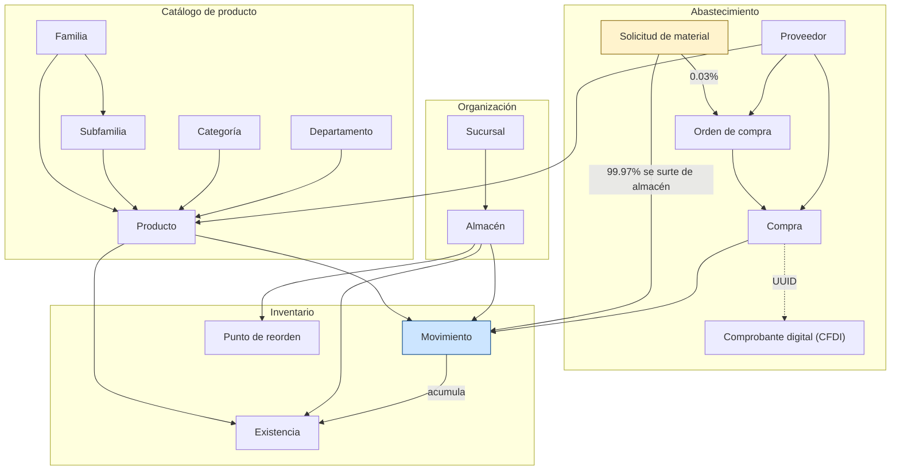
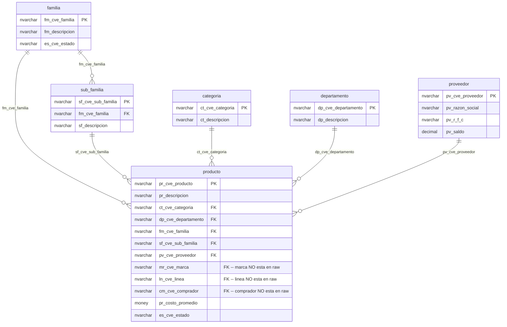
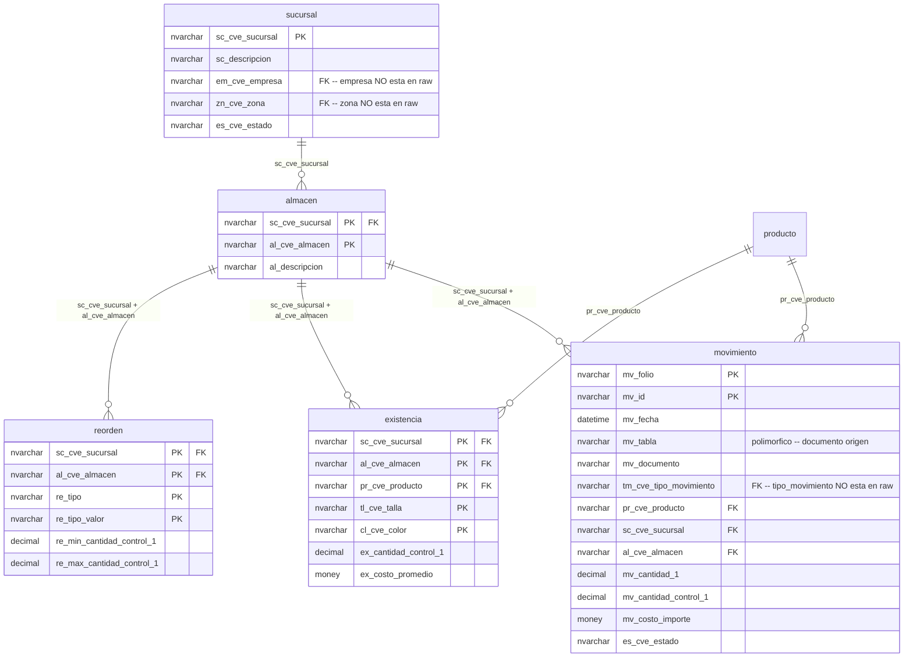
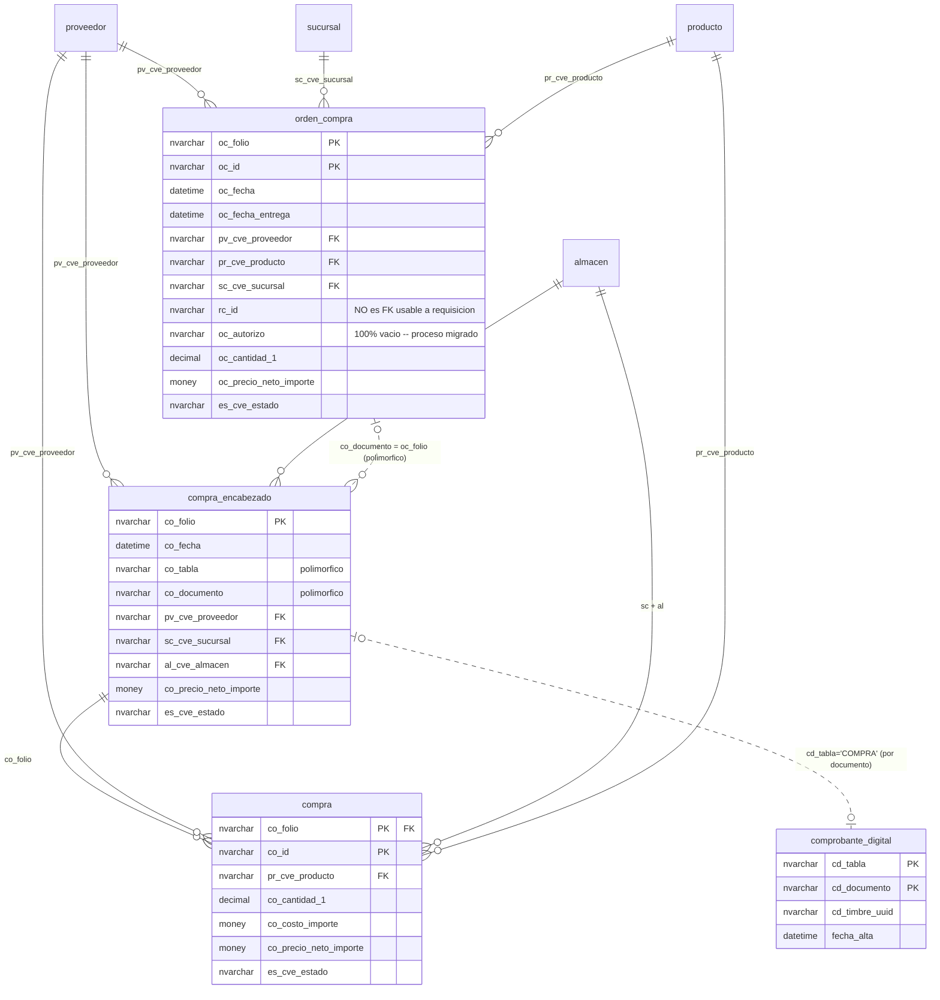
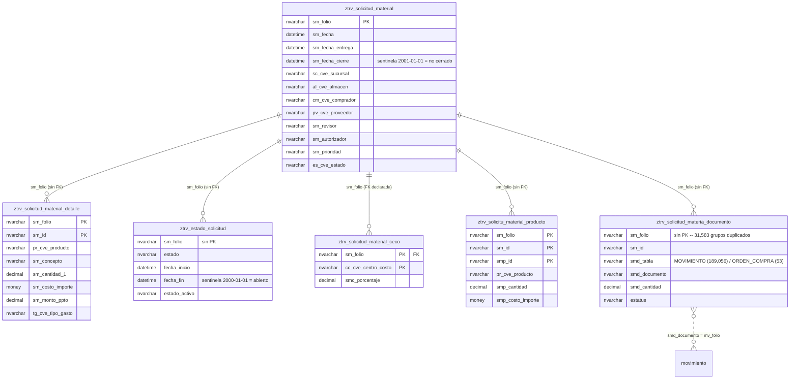
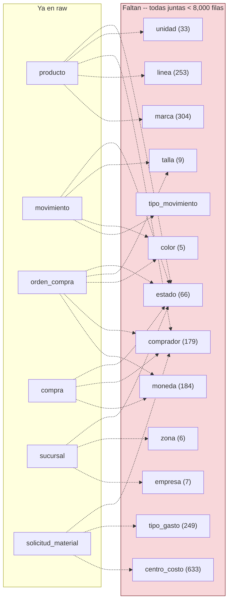

# Modelos de datos — lo que hay en `raw`

> Modelo conceptual y lógico de las **22 tablas ya replicadas** a `trivasa_dw.raw`. Solo se dibujan relaciones **verificadas**: FKs declaradas en SQL Server, o joins validados con datos reales. Las que son convención sin respaldo del motor van punteadas y anotadas.
>
> Verificado 2026-08-12 contra `information_schema` de Postgres, `sys.foreign_keys` de SQL Server y conteos sobre `raw`.

## Cómo leer estos diagramas

| Notación | Significado |
|---|---|
| Línea continua | **FK declarada** en SQL Server |
| Línea punteada | Relación **real pero no declarada** — validada con datos, se documenta el join |
| `||--o{` | Uno a muchos |
| `}o--||` | Muchos a uno |
| Caja gris "(falta)" | Dimensión que el ERP referencia pero **aún no está en `raw`** |

Nombres en minúsculas porque así los normaliza dlt en Postgres. En el origen son `Pr_Cve_Producto`, aquí `pr_cve_producto`.

---

## Modelo conceptual

El negocio que hoy cubre `raw`, sin detalle de columnas:



**La lectura de negocio:** una solicitud de material casi siempre se resuelve contra inventario (genera un `Movimiento` de salida). Solo una fracción mínima escala a orden de compra → compra → entrada de inventario. Ver [Solicitud de material](solicitud-material.md).

---

## Modelo lógico por dominio

### Catálogo de producto

El único bloque completo en `raw`: todas las dimensiones que `producto` referencia y que ya están replicadas.



> ⚠️ **Cuidado con el nombre de la subfamilia.** En SQL Server la columna es `Sf_Cve_SubFamilia` y la tabla `SubFamilia`; dlt las normaliza a `sf_cve_sub_familia` y `sub_familia`. Es el único caso del set donde el nombre cambia de forma no trivial.

### Organización e inventario



`existencia` es el **saldo vigente** mantenido por el ERP; `movimiento` es el libro de asientos. No se derivan uno del otro en `raw` — la relación es de acumulación y se resuelve en dbt. El método validado para reconstruir existencia a una fecha pasada está en [Inventario](inventario.md#existencia-a-una-fecha-pasada).

`reorden` no apunta a `producto` con una FK: su clave es `(re_tipo, re_tipo_valor)`, un par genérico que puede referirse a producto, familia u otro nivel según `re_tipo`. **No unir a `producto` sin filtrar por `re_tipo` primero.**

### Compras



Dos advertencias que este diagrama codifica:

- **`orden_compra.rc_id` NO sirve para unir con requisición.** Parece una FK y no lo es: el join naive tiene 83 % de fechas invertidas por colisión de folios. Ver [Calidad de datos](calidad-de-datos.md#joins-que-parecen-obvios-pero-son-falsos).
- **El enlace OC→Compra es polimórfico**, no por folio directo. Validado en `raw`: 95,913 filas de `compra_encabezado` con `co_tabla='ORDEN_COMPRA'`, que enlazan a 22,952 órdenes distintas.

### Solicitud de material

El bloque `ZTRV_*` es una personalización de Trivasa. **Casi no tiene FKs declaradas** — solo `ceco → solicitud_material`. Todo lo demás es convención sobre `sm_folio`, validada aquí con datos.



`ztrv_solicitud_agenda_logistica` (170 filas) queda fuera del diagrama: no comparte `sm_folio` — se relaciona con pedido (`pd_folio`), orden de entrega (`oe_folio`), vehículo y chofer, ninguno de los cuales está en `raw` todavía.

---

## Integridad verificada en `raw`

Conteos de huérfanos sobre los joins por convención (2026-08-12):

| Relación | Huérfanos | Sobre |
|---|---:|---|
| `ceco` → `solicitud_material` | **0** | 35,123 |
| `solicitu_material_producto` → `solicitud_material` | **0** | 74,359 |
| `solicitud_material_detalle` → `solicitud_material` | 3 | 250,987 |
| `estado_solicitud` → `solicitud_material` | 4 | 310,661 |
| **`solicitud_materia_documento` → `solicitud_material`** | **2,222** | 189,107 |
| `solicitud_materia_documento` → `movimiento` | 59 | 971,664 |

Los tres primeros son limpios. Los 2,222 documentos sin cabecera (**1.2 %**) son el único hallazgo material: hay documentos que apuntan a solicitudes que no existen en la tabla madre. Usar `INNER JOIN` cuando la cabecera sea necesaria, y no asumir que todo documento tiene solicitud.

> El join `smd_documento = mv_folio` es a **nivel folio**, y `movimiento` tiene varias líneas por folio (PK `mv_folio + mv_id`). De ahí el fan-out: 189,056 documentos producen 971,664 filas. Agregar antes de unir si no se quiere multiplicar.

---

## Lo que falta para cerrar los modelos

Las dimensiones que el ERP referencia con FK declarada pero que **aún no están en `raw`**:



**`estado` es la más urgente**: la referencian 660 FKs en toda la base y son **66 filas**. Sin ella, ningún modelo puede traducir `es_cve_estado` a una descripción legible, y el filtro de cancelados queda como literal mágico (`!= 'CA'`) en cada modelo.

Después: `tipo_movimiento` (para clasificar `movimiento` según [Inventario](inventario.md#clasificacion-de-tm_cve_tipo_movimiento)), y el resto de dimensiones de producto (`marca`, `linea`, `unidad`).

Detalle de prioridades en [Warehouse](warehouse.md#que-falta-800-tablas-con-datos).

---

## Referencia rápida de joins

Los que están confirmados y se pueden usar sin volver a validar:

```sql
-- Producto con toda su jerarquía de catálogo
FROM raw.producto p
LEFT JOIN raw.familia      f  ON p.fm_cve_familia     = f.fm_cve_familia
LEFT JOIN raw.sub_familia  sf ON p.sf_cve_sub_familia = sf.sf_cve_sub_familia
LEFT JOIN raw.categoria    c  ON p.ct_cve_categoria   = c.ct_cve_categoria
LEFT JOIN raw.departamento d  ON p.dp_cve_departamento= d.dp_cve_departamento
LEFT JOIN raw.proveedor    pv ON p.pv_cve_proveedor   = pv.pv_cve_proveedor

-- Movimiento con producto y ubicación (almacén es clave compuesta)
FROM raw.movimiento m
JOIN raw.producto p ON m.pr_cve_producto = p.pr_cve_producto
JOIN raw.almacen  a ON m.sc_cve_sucursal = a.sc_cve_sucursal
                   AND m.al_cve_almacen  = a.al_cve_almacen
JOIN raw.sucursal s ON m.sc_cve_sucursal = s.sc_cve_sucursal
WHERE m.es_cve_estado <> 'CA'

-- Compra: cabecera + partidas + la orden que la originó (polimórfico)
FROM raw.compra_encabezado ce
JOIN raw.compra c  ON c.co_folio = ce.co_folio
LEFT JOIN raw.orden_compra oc ON ce.co_documento = oc.oc_folio
                             AND ce.co_tabla     = 'ORDEN_COMPRA'

-- Solicitud con su traza de estados (deduplicar y filtrar sentinela)
FROM raw.ztrv_solicitud_material sm
JOIN (
    SELECT DISTINCT sm_folio, estado, fecha_inicio, fecha_fin
    FROM raw.ztrv_estado_solicitud
    WHERE fecha_fin > '2001-01-01'
) e ON e.sm_folio = sm.sm_folio

-- Solicitud → el movimiento que la surtió (INNER: 1.2% de docs son huérfanos)
FROM raw.ztrv_solicitud_material sm
JOIN raw.ztrv_solicitud_materia_documento d ON d.sm_folio = sm.sm_folio
                                           AND d.smd_tabla = 'MOVIMIENTO'
JOIN raw.movimiento m ON m.mv_folio = d.smd_documento
```
